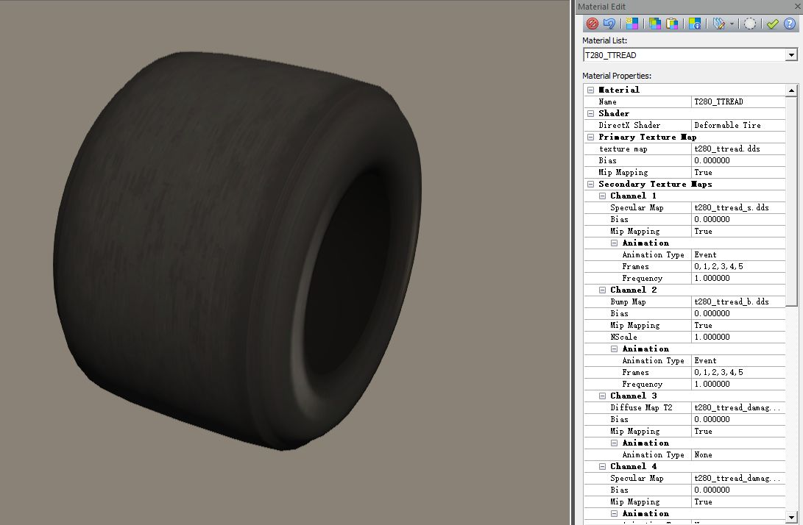
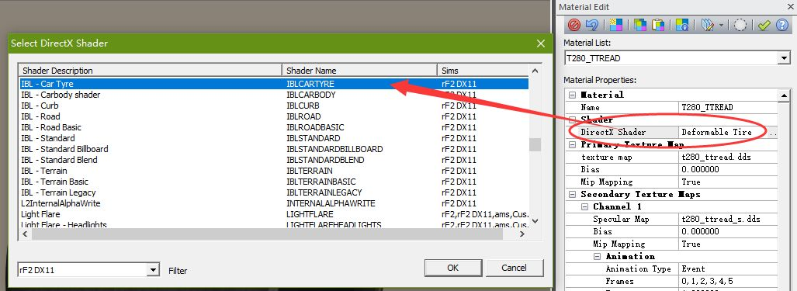
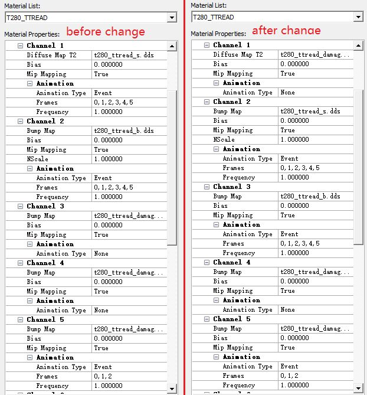
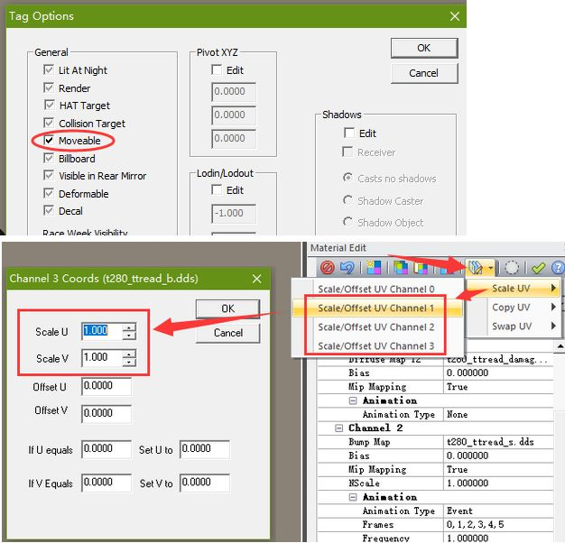
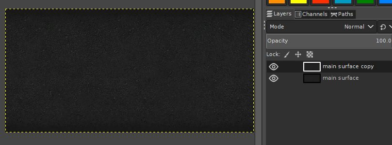
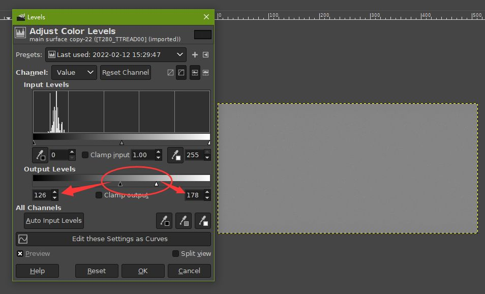
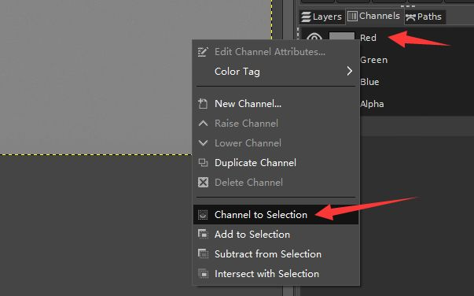
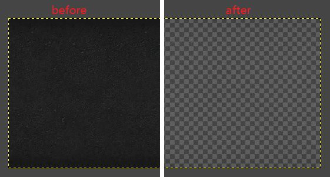
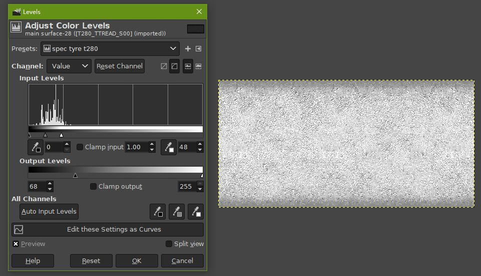
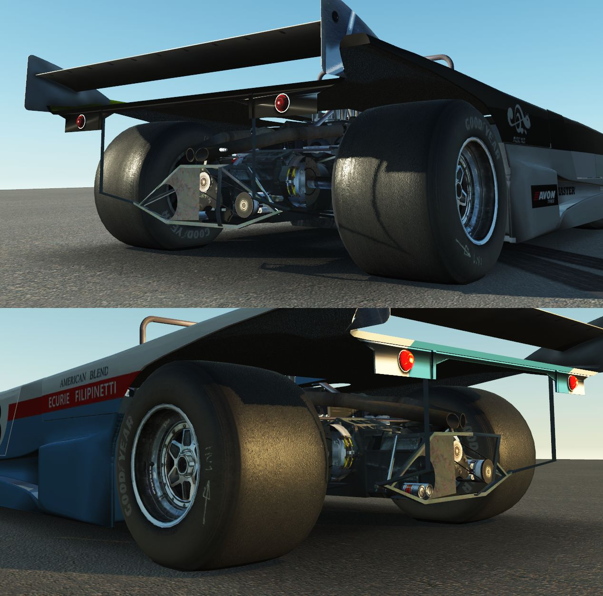

# Apply new IBL tyre shader & PBR materials for old mods

This guide demonstrates a quick way of applying new IBL Tyre shader for old mods, as well as the necessary changes to texture for PBR materials. 3dsimed & LOLA T280 tyre are used as example.

Note: it is also possible to do this using rF2 "materialeditor". Also recommended to check out "IBL Car Tyre Shader definitions" from rF2 official guide.

1
---
Open tyre gmt in 3dsimed, then open Material Edit panel, and find tyre materials. Depends on mod, sometimes mod can have tyre tread & tyre wall as separated materials, so you will have to repeat this process for each tyre materials. Also careful editing is needed to make sure you don't miss a parameter which could result wrong visual effect.

2
---
Looking at Material Edit panel, there are many things that we will need to change.

Normally a correctly configured old mod tyre uses "Deformable Tire" shader, which has 5 active channels. If not, then the mod probably is missing some required textures, and you might be need to create them from scratch.

In this example of T280, those 5 channels & corresponding texture names of "Deformable Tire" shader are:
* channel 1 = t280_ttread_s.dds (6 frames animation)
* channel 2 = t280_ttread_b.dds (6 frames animation)
* channel 3 = t280_ttread_damage.dds(doesn't have animation)
* channel 4 = t280_ttread_damage_s.dds (doesn't have animation)
* channel 5 = t280_ttread_damage_b.dds (3 frames animation)

Now we need to change "DirectX Shader" to "IBL - Car Tyre". Once done, you will see that active channel numbers become six (note: the sixth channel is not used).

3
---
Next, we just need to assign old texture maps to the new "IBL - Car Tyre" channels.

Channel 1 (damageAlbedoRoughMap):

In this channel, we will need place "damageAlbedoRoughMap", which corresponding to the old damage diffuse map from Channel 3 of the "Deformable Tire" shader. And, you can just copy old Channel 3 settings to Channel 1 now, in this case it is t280_ttread_damage.dds.

Important note:

When copying channel settings, make absolutely sure that you have also copied animation type settings correctly, which is crucial for displaying tyre motion animation. (every mod has different amount animation frames, some doesn't have animation at all).

Channel 2 (aoSpecularMap):

In this channel, we will need place "aoSpecularMap", which corresponding to the old spec map from Channel 1 of the "Deformable Tire" shader. In this case it is t280_ttread_s.dds.

Channel 3 (normalMap):

In this channel, we will need place "normalMap", which corresponding to the old bump map from Channel 2 of the "Deformable Tire" shader. In this case it is t280_ttread_b.dds.

Channel 4 (damageAoSpecularMap):

In this channel, we will need place "damageAoSpecularMap", which corresponding to the old damage spec map from the same Channel 4 of the "Deformable Tire" shader, so there is no change needed for this channel. In this case it is t280_ttread_damage_s.dds.
Note: if the mod lacks good damageAoSpecularMap textures, you can also use main aoSpecularMap as substitute.

Channel 5 (damageNormalMap):

In this channel, we will need place "damageNormalMap", which corresponding to the old damage bump map from the same Channel 5 of the "Deformable Tire" shader, in this case it is t280_ttread_damage_b.dds (no change).

Channel 6 (unused):

This channel is not used in game, just put _DefTex_Nm_BC5 inside box as placeholder.

The whole process will look like following:
* "Deformable Tire" -> "IBL - Car Tyre"
* channel 1: t280_ttread_s.dds -> t280_ttread_damage.dds
* channel 2: t280_ttread_b.dds -> t280_ttread_s.dds
* channel 3: t280_ttread_damage.dds -> t280_ttread_b.dds
* channel 4: t280_ttread_damage_s.dds -> t280_ttread_damage_s.dds (no change)
* channel 5: t280_ttread_damage_b.dds -> t280_ttread_damage_b.dds (no change)

Repeat above channel editing until all tyre materials are set correctly. Then just save the new tyre gmt to mod folder.

Important note 1: if tyre gmt has pivot point setting, and they are opened as "objects", make sure their pivot point are saved as well (you can do this by apply Moveable tag to all tyre object before export to gmt).

Important note 2: You may also need to check UV channel scale, make sure UV channel 1, 2, 3 have set correct Scale value. Usually UV Scale value should be set to 1, unless mod is using a different UV map for damage/spec/bump map. Scale value must not be 0, otherwise tyre material will not show correctly.

4
---
Now, if you load car in DevMode, you will not see any reflection on tyre, tyre will look very flat. And this is normal, because we haven't apply any roughness to texture, which is required now for PBR material. We will also need to adjust old spec map for better Specular effect.

The textures that we are going to edit in this example:
* AlbedoRoughMap (from primary Texture map): t280_ttread.dds
* damageAlbedoRoughMap (from channel 1): t280_ttread_damage.dds
* aoSpecularMap (from channel 2): t280_ttread_s.dds
* damageAoSpecularMap (from channel 4): t280_ttread_damage_s.dds

5
---
First, we will be editing AlbedoRoughMap, load t280_ttread.dds in GIMP (delete mipmap if any). You may also need to make sure that main layer already has alpha channel (if not, Right Click on main layer, select "Add Alpha Channel"). Then duplicate main layer as below:

Select duplicated layer ("main surface copy" in this case), apply Desaturate from menu Colors.

Then open Levels... from menu Colors, adjust Output Levels such as following (just an example), so that the image is closer to middle grey. You have to be careful when adjust "Low Output" & "High Output" values(if they are too close to each other, whole image will become flat grey, and details will be lost).

Next, we switch to Channels panel, Right Click on any of the 3 main channel, select "Channel to Selection".

Switch back to Layers panel, delete duplicated layer ("main surface copy"), then Press Delete key one time from keyboard. Now you will see that texture becomes transparent, which we have just applied new roughness on the texture. The less opacity, the more smoothness.

Note 1: you will probably need to play with Level settings to find best opacity for your mod. Remember to save Level settings as preset, so can be reused later.

Note 2: You might also wonder, why not just change main layer opacity directly, so it will be much faster and easier? That is because by changing layer opacity directly, the end result will look more uniformed(flat smoothness), and won't be as good as deleting selected amount opacity.

You have to repeat above process for every AlbedoRoughMap & damageAlbedoRoughMap textures.

6
---
Now we need to adjust AoSpecularMap & damageAoSpecularMap.

Load spec map texture t280_ttread_s.dds in GIMP. Desaturate first, then open Levels, and adjust it until it looks mostly white, while still has some details (any other brightness adjusting methods will work too). You will need to do some test to find best value.

And repeat above process for every AoSpecularMap & damageAoSpecularMap textures.

Once all done, save them to TGA format, then use rF2 MapConverter to convert them into proper DDS format.

Note: you can also save them as old DXT5 (for AlbedoRoughMap) and DXT1 (AoSpecularMap) format directly using GIMP, which is easier but highly not recommanded because noticable quality loss.

Now load up car again in DevMode, this time the tyre should have proper spec & rough effect:

Note: it is also possible to adjust & add roughness without editing AlbedoRoughMap (by using materialeditor), but the results may not be as good as manually editing each texture.
