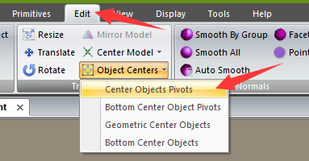
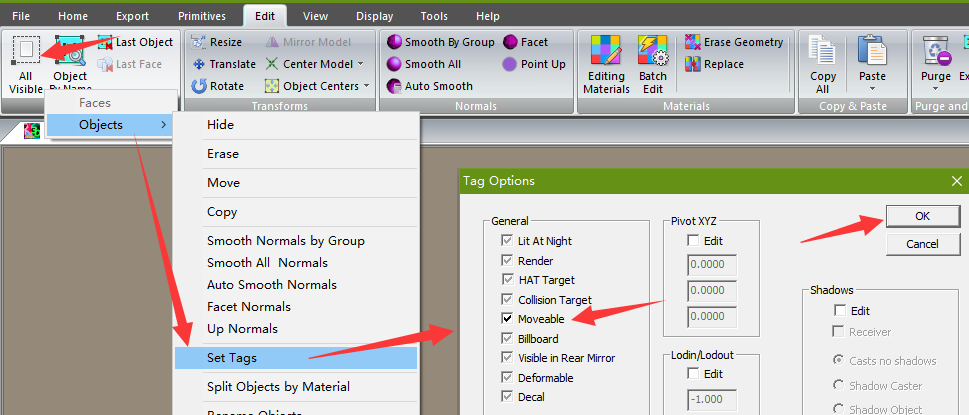

# Center pivot point individually on all objects in 3dsimed

1
---
From main menu "Import as Objects" to import all objects.

2
---
Switch to Edit tab, from Object Centers dropdown list, select Center Objects Pivots.

3
---
Select all objects by click All Visible button(or use Alt+A), select Objects > Set Tags

4
---
Then activate "Moveable" checkbox, and click ok, as pic shows. This step is very important, in order to save Pivot Point into exported GMT.

5
---
Last, export GMT. Also make sure in SCN (for track) or GEN (for car) file, there is a line inside each GMT instance brackets as "Moveable=True", otherwise you may not see the object in game.
