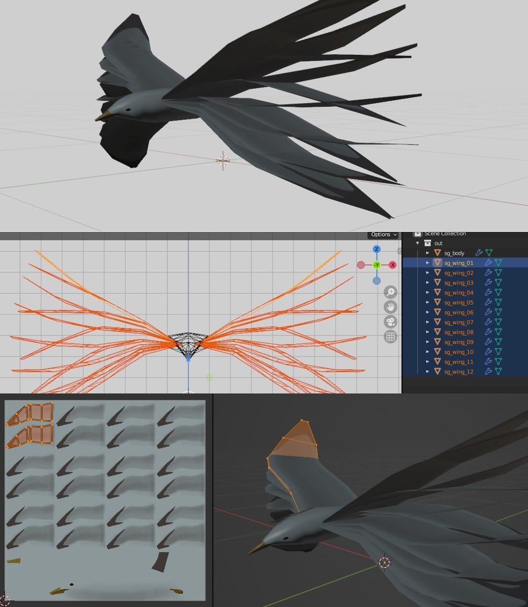
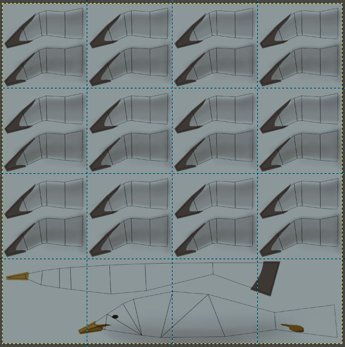
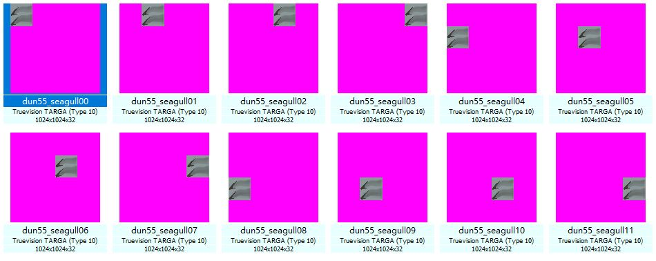
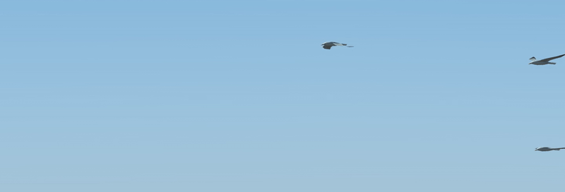

# Create 3D animation using Blender + GIMP

This guide provides some insight for creating 3D animation using only free & open source software for rF2.

The main idea is to use a sequence of 3D models of an object in combination with sequenced texture animation, which shows only one frame of the real 3D models at a time.

The example here is a simple seagull model I made for Dundrod 1955.

The seagull's wings are made into multiple copies of 3D models, each model represent a frame of the object animation. And then each model's UV is mapped at specific coordinates which reveals one of the wing models only at specific texture frame.

In this example, there are 12 frames, which results 12 wing models(as frames), and the corresponding texture is split into 4x4 grids. 4x3 rows are used for paint wings. Each wing frame will take one grid of the texture, and is saved to one of the texture sequence while other frames are set invisible.

Final model & single wing UV map:

Final UV map & texture of all wings objects in GIMP:

Final exported texture sequence:

And material(JSON) setting for wings:
* "FrameCount" is the number of available texture sequence, which is 12 in this case.
* "Rate" is playing speed, high number faster.
* "Sequence" is playing order and sequence, the number is each texture's last digits, and can be repeated.
* "Texture" is the texture file name without last digits.
(alternatively, 3dsimed can be used to setup animation frames in GMT file.)

Example of animation code in JSON file:

    "textures": [
        {
            "AnisoLevel": 0,
            "ChromaColor": 0,
            "Flags": [
                "CUBETF_AUTOMIPMAP",
                "CUBETF_TRILINEAR",
                "CUBETF_CHROMAKEY",
                "CUBETF_OWNEDBYMATERIAL",
                "CUBETF_NOZBUFFERREQUIRED"
            ],
            "FrameCount": 12,
            "Method": "CUBETAM_CYCLE",
            "MipBias": 0,
            "MipLevels": 1,
            "Name": "albedoMap",
            "Rate": 15,
            "Sequence": [
                0,
                1,
                2,
                3,
                4,
                5,
                6,
                7,
                8,
                9,
                10,
                11,
            ],
            "ShaderPass": 0,
            "ShadowMipBias": 0,
            "SkipFrame0": false,
            "StageType": "CUBETST_SRGB",
            "TexChannel": 0,
            "Texture": "seagull",
            "hasDefault": true,
            "inactive": false,
            "runtime": false
        }
    ]

How animation plays in Dundrod 1955 (with additional pivot point rotation animation):

Finally, if there are a pack of seagulls, the above material can be duplicated with different "Rate" or "Sequence" setting for different seagulls to generate more randomness and dynamic animation, which also makes this method more flexible.
