# Create 3D fireworks animation in rFactor2

RF2 normally doesn't support modding real particle animation. This implementation utilizes RF2's new IBL shader and texture animation to emulate dynamic 3D fireworks animation.

# Basic Concept

The main idea is to create a bunch of 3D strips, radiating outward to form a sphere-like fireball. Then, create a fire particle texture, which will be animated using "scrolling animation" to move the particle texture along the 3D strip, emulating fire particle explosion trajectory.

For explosion type & speed randomization, this can be done by adjusting the rate of "scrolling animation" and UV map scaling, and also combining multiple different fire particle textures into one bigger texture.

For color randomization, this can be done by using IBL standard blending shader, applying an "overlay" color texture map on top of fire particle texture, and set this overlay map with random moving animation via "scrolling animation", effectively result random fireworks color.

For explosion position randomization, this can be done by using RF2's "object rotating animation".

## Preview from "Dundrod 1955" mod:

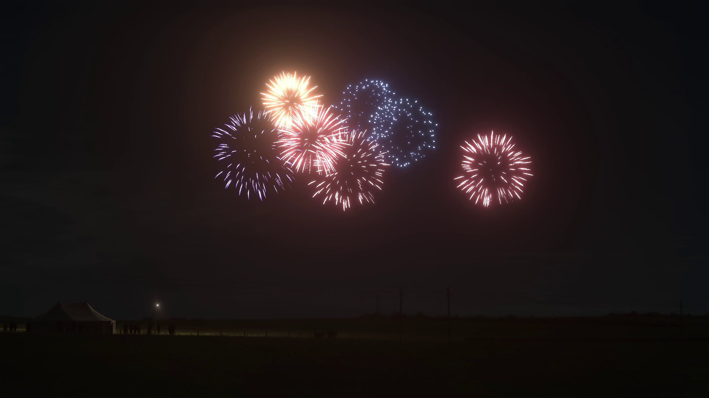

# Creating 3D fireball model in Blender

Note, basic blender usage is not covered here. This part is meant to share basic idea of how fireworks models are constructed, there can be different ways to create similar 3D models for fireworks.

1
---
"Add" a new "Bezier" curve object, rename it to "fireball". Then adjust curve control points (nodes) to emulate particle travel path.

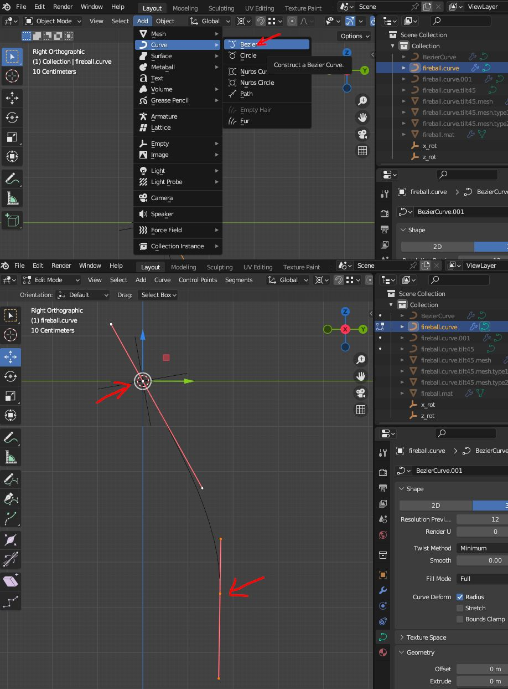

2
---
Rotate the "fireball" curve object so it aligns to "X viewpoint".

3
---
In object "Data" panel, set curve "Shape" to "3D", "Resolution Preview U" to "5", "Geometry Extrude" to "0.05 m".

4
---
Select curve's end node, then select "Control Points" > "Tile", and set "Tilt Angle" to "45" degrees. This step is meant for adding some rotation to particle moving path for more varied visual effect.

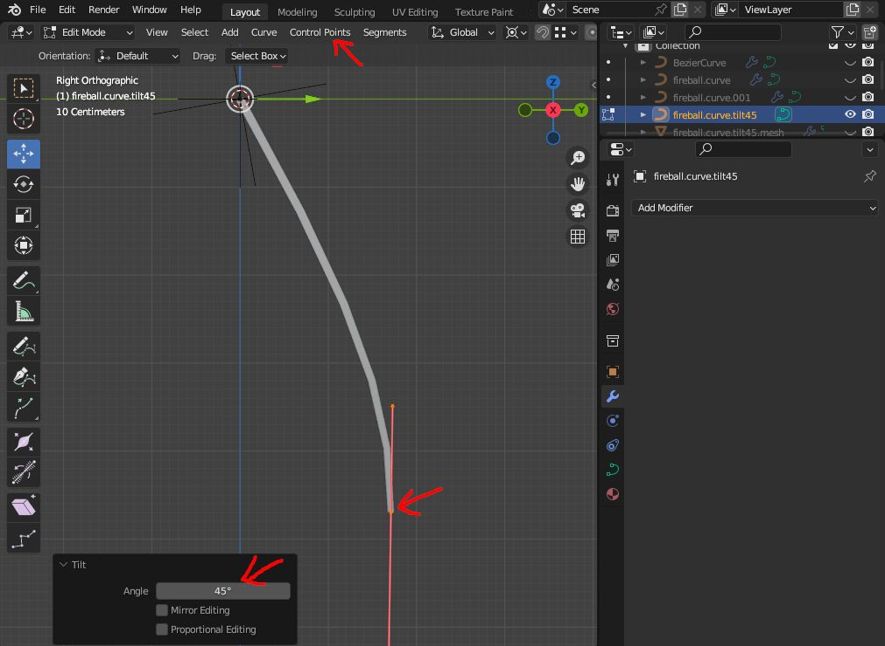

5
---
"Add" two "Empty" "Plain Axes" objects, which will be used for "array modifier". Name the first "Plain Axes" object as "x_rot", and the second as "z_rot". Press "N" to open "Transform" panel, select "x_rot" object, set "Rotation X" to "10" degrees. Then select "z_rot" object, set "Rotation Z" to "-45" degrees.

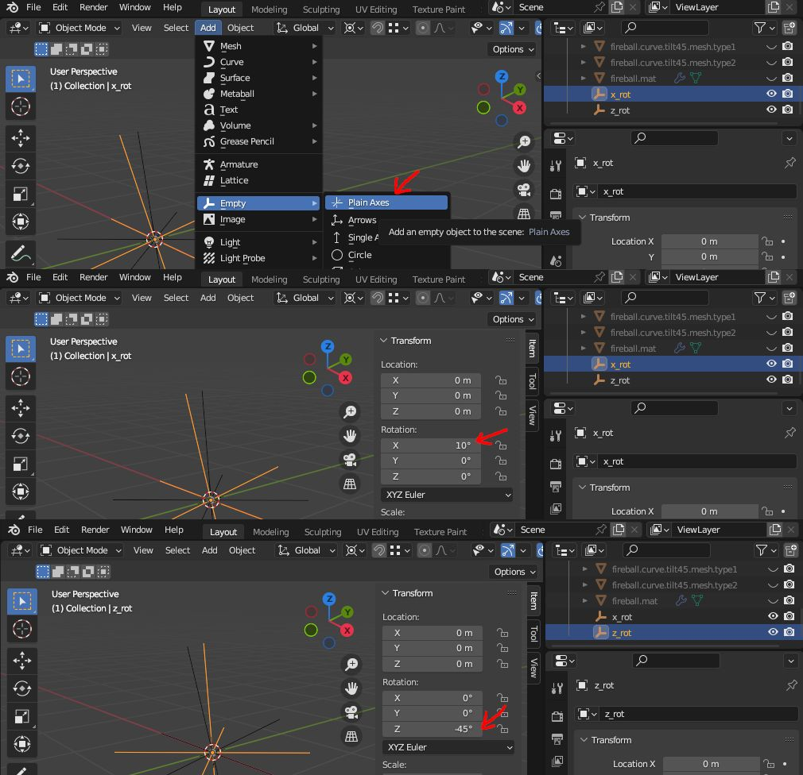

6
---
Select the "fireball" curve object, from "Object" menu, select "Convert" > "Mesh". Open "Modifiers" panel, add two "Array" modifiers, uncheck "Relative Offset", then check "Object Offset", set "Count" to "16" and "Object" to "x_rot" for first array. Set "Count" to "8" and "Object" to "z_rot" for second array. And it will now looks like a "ball" with many branches.

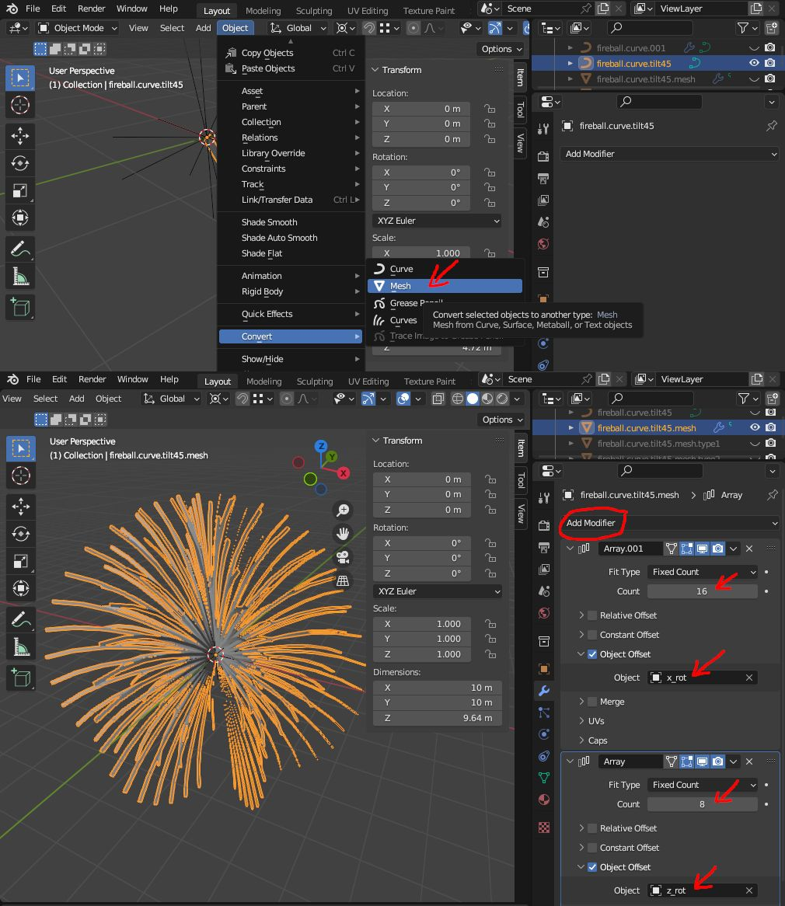

7
---
Next (optional), select the "fireball" object, and enter "Edit" mode, then select some branches, and scale them bigger or smaller, which will make particle movement more random later on.

8
---
Open "Modifiers" panel, and apply the two "Array" modifiers on the "fireball" object.

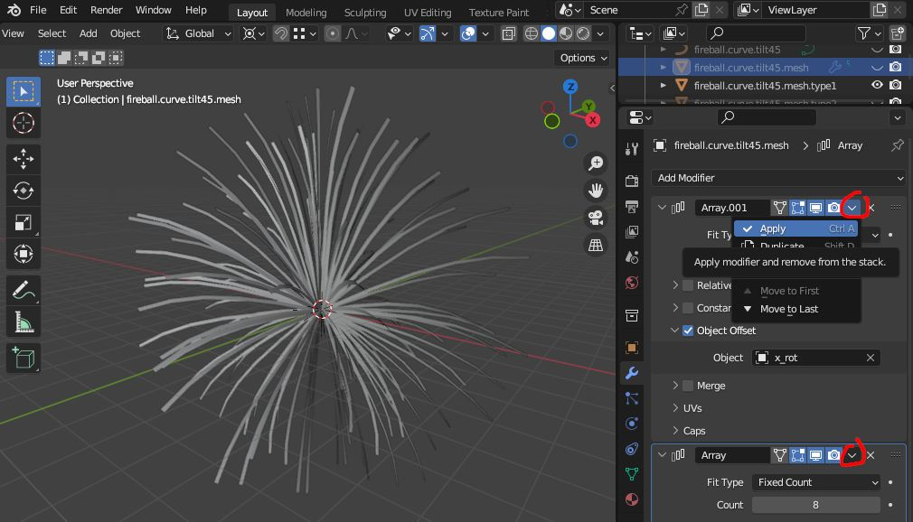

9
---
Add a new material to the "fireball" object, name it as "fireball01" (the numeric suffix is necessary, as we need more different copies later on), and assign texture to it (such as "fireball_Alba.tga"). UV map will be auto-created by blender (no need to remap UV map in this case).

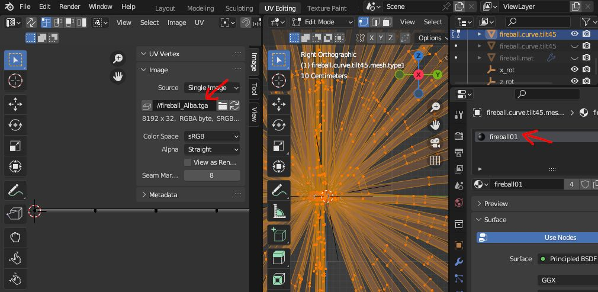

10
---
Now scale "fireball" object to around 40 to 50 meters width (in RF2's scale, which equals to 0.4 to 0.5 in blender), depends on how big the explosion you would like. In this case, I scaled it to around 50 meters diameter. Place the "fireball" object 20 to 70 meters above road or terrain surface (measure from center of ball), depends on how high the explosion you would like. In this case, I placed it 50 meters above road.

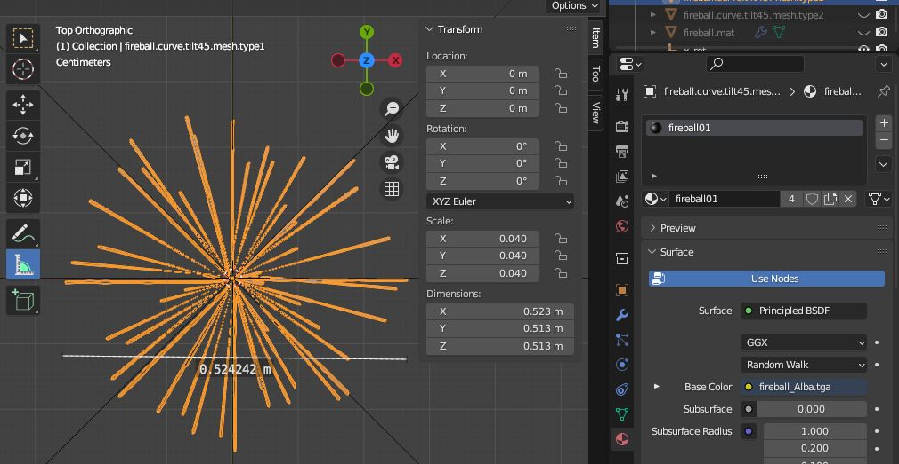

11
---
Export the "fireball" object to "GMT" file in your track mod folder, and rename it with numeric suffix, such as "fireball_001.gmt", as later on you probably want to add many copies to create fireworks clusters.

# Create fire particle, emissive, color overlay textures in GIMP

In this example, I setup a texture with a size of 8196 x 64 pixels, which holds two different types of fire particles: one with fire trail (long tail), one without.

## Fire particle texture

1
---
Create a 8196 x 64 texture, then zoom in, move view to left canvas edge, paint a drop-like shape particle with grey color (#AAAAAA in this case). Note, the color of the particle will affect the brightness of fireworks. Below pic shows how the shape looks like with alpha channel set to hidden.

2
---
Move the view to the center of canvas, and draw another drop-like shape particle with significantly longer tail, this will be used as the second type of fire particle.

3
---
Export the file as fireball_Alba.tga.

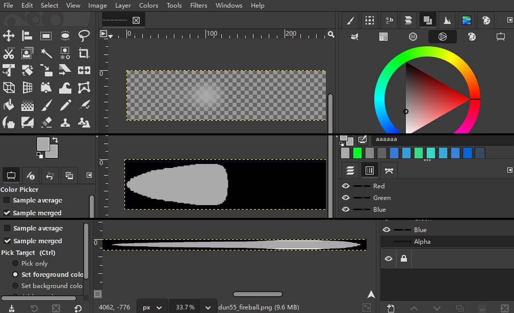

## Emissive map

This texture will be used to control particle fade out effect. It will be a simply linear gradient texture from white to black.

1
---
Create a 2048 x 32 texture, then use Gradient tool to fill gradient color from white to black, as below.

2
---
Export the file as fireball_Em.tga.

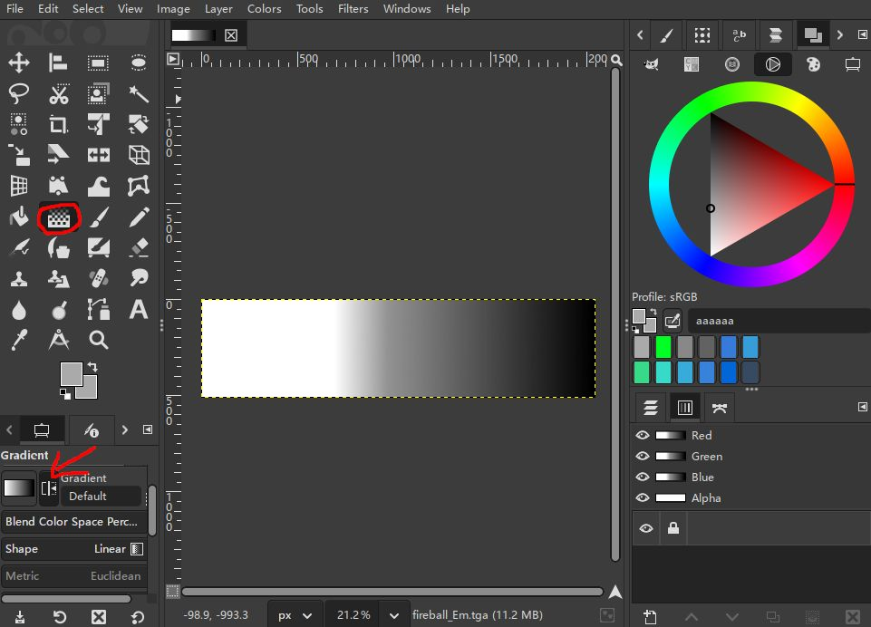

## Color overlay map

This texture will be used to apply random color on top of fire particle texture to achieve random color explosion.

1
---
Create a 1024 x 1024 texture, then paint random color on it. There are many ways to do that, such as using "Filters > Render > Noise > Plasma". You may also want to limit the range of color, so some unusual color will not be included.

2
---
Apply "Filters > Blur > Gaussian Blur" to smooth out transition, and apply "Filters > Map > Tile Seamless".

3
---
Export the file as fireball_Ova.tga.

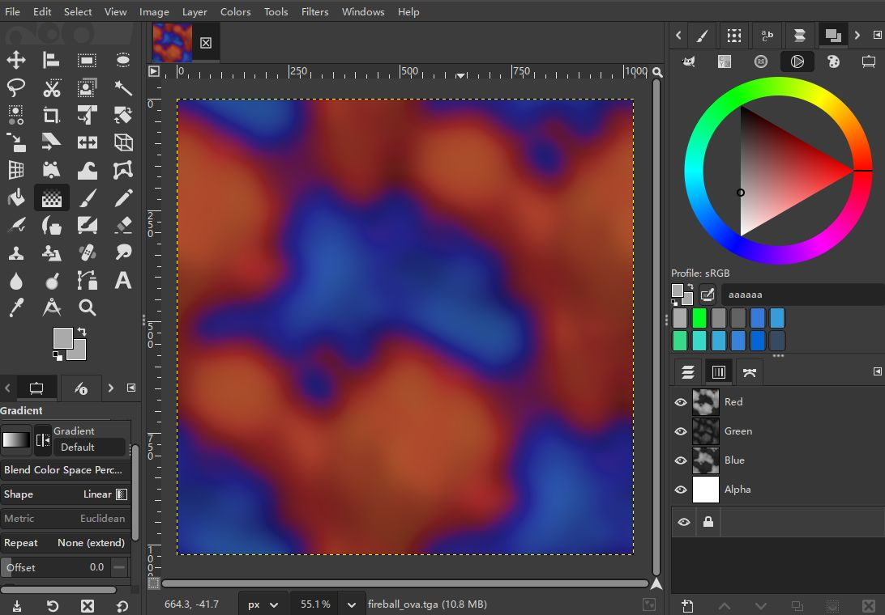

Finally, use RF2's MapConverter to properly convert all TGA to DDS.

# Setup SCN file and material JSON

## SCN file setup

In SCN file, add following lines:

    Instance=fireball_001
    {
        VisGroups=(1024)  // show only in night
        MeshFile=fireball_001.gmt CollTarget=False HATTarget=False
    }

## Material JSON setup

For material JSON, we will use IBL standard blending shader:

1
---
Set shader to "L2IBLSTANDARDBLEND".

2
---
Set "Albedo Function" to "Multiply", "A UV" to "UV_A", Animate to "UVW_Scroll". "B UV" to "UV_B", "Animate" to "UVW_Scroll".

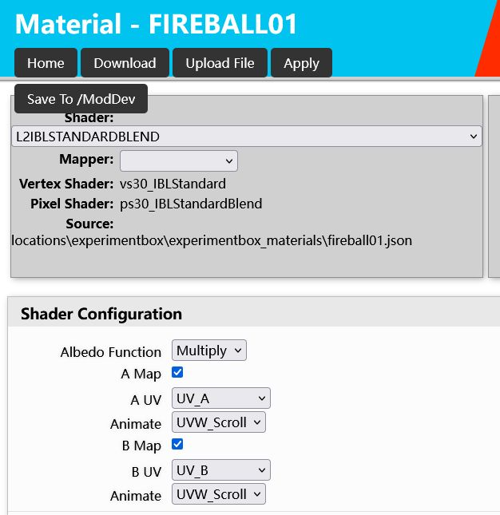

3
---
Set "Emissive" function to "Night", "Use Map Mask" to "Mask_RG", "UV" to "UV_A". Then make sure "Emissive Scalar" value is set to "5000" (or higher, which affects brightness of the fire particle).

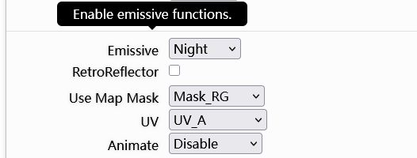

4
---
Under "UV_Scale", set Albedo "U scale" to "0.24", this value affects the length of fire particle and fire interval. Keep "V scale" as 1. Then set Emissive "U scale" to "0.99", this is done to avoid texture edge bleeding.

5
---
Under "UV_Animate", set "U rate" to a negative value, such as -0.0875. This value controls fire particle moving speed. Then set "V rate" to 0, as we don't want the particle to move vertically on the 3D strip.

6
---
Under "AlbedoAlt", set rate to any random value you like, this value controls how fast random color changes with each explosion, which this value should be kept quite low.

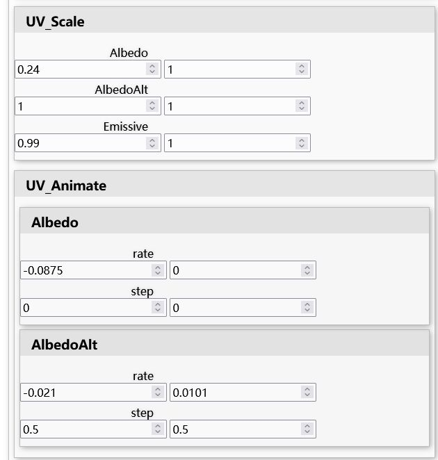

7
---
Assign textures to each map channel, and make sure "Chroma Transparency" is checked for "albedoMap" channel, then save the material.

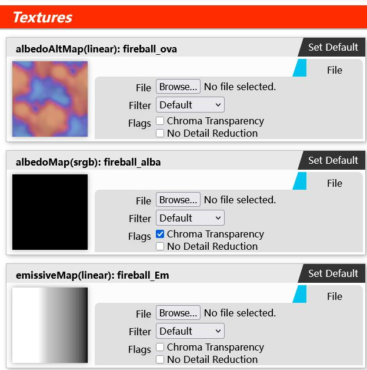

8
---
Go to your material folder, open material JSON with notepad, then add "CUBEMAT_TWOSIDED" to "flags" section, such as below:

    "flags":[
        "CUBEMAT_SPECULAR",
        "CUBEMAT_TWOSIDED",
        "CUBEMAT_AMBIENTMAT",
        "CUBEMAT_DIFFUSEMAT",
        "CUBEMAT_SPECLARDIR",
        "CUBEMAT_EMISSIVMAT",
        "CUBEMAT_EMISSIVDIR"
    ],

This step is most important to make sure fireworks can be viewed at any direction.

Finally, reload the track in DEV mode, the fireworks should be playing now.

## To create a cluster of fireworks

Copy the fireball GMT and material JSON files, name them with unique numeric suffix, such as fireball_001.gmt, fireball_002.gmt, fireball_003.gmt ... FIREBALL01.json, FIREBALL02.json, FIREBALL03.json ...

Then, open each GMT file and assign new material name that matches JSON file name. And individually adjust "UV_Scale", "UV_Animate", "AlbedoAlt" values as from step 4 to 6 for each different fireball copy. This way the fireworks cluster will be fully randomized when playing.

(Just make sure that each fireball uses its own unique material with unique animation setting in a single fireworks cluster, so animations are played randomly without same repetition.)
