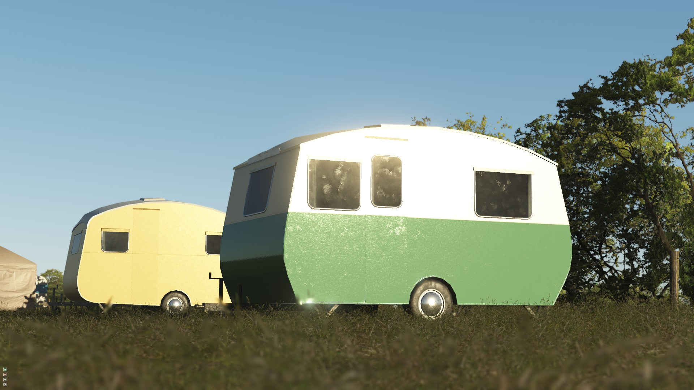
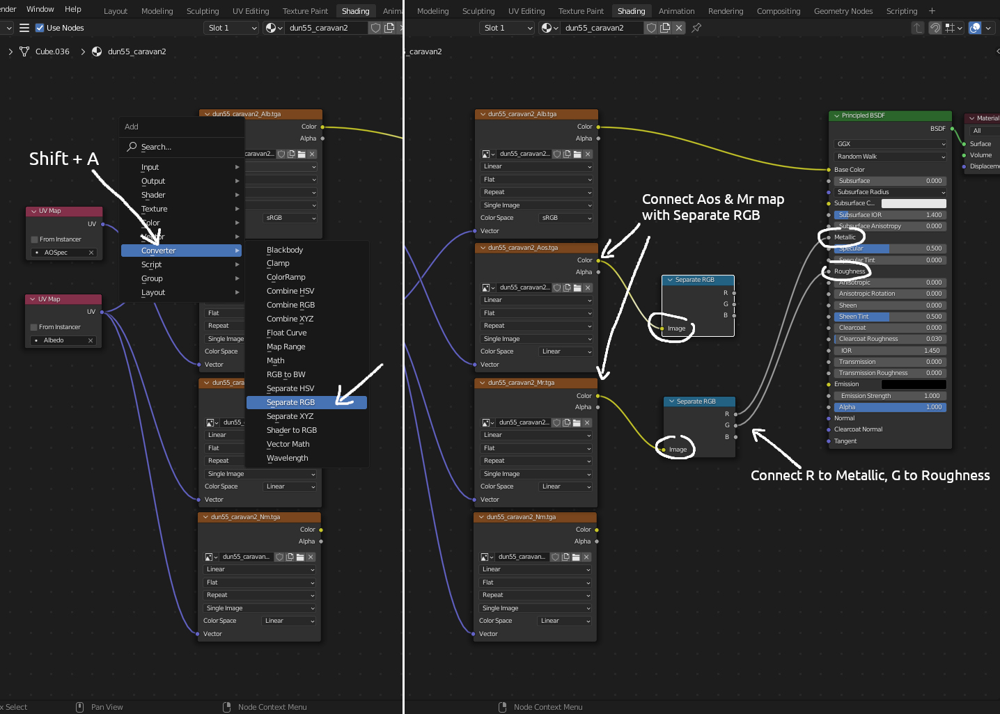

# Create PBR material from scratch using Blender + GIMP

This guide provides basic methods for creating PBR Material (textures) from scratch using Blender + GIMP (all opensource programs) to be used in RF2.

Before start, here is a reference sheet to help visualize the usage of basic PBR textures in RF2:

The basic material creation is to individually adjust 3 color channels (RGB). Those channels are in grey scale, which means you only manipulate the light/darkness of each channel.

In the following guide, I'll be using a caravan model I made as an example.

# Bake AO in Blender for 3D model

1
---
Open 3D model, and switch to "UV Editing" tab at top. Assume the 3D model already has a "UV map". If not, there are many UV mapping tutorials can be found from online video websites. Sometimes we may also want to place and map AO in one of the secondary UV channels (optional), so you can have a different UV map for other materials.

Important note for using official material editor:

It is vital to correctly set "UV channel" tag (UV_A, UV_B, UV_C, UV_D) in material editor that matches the UV channel number & order in 3D model, otherwise you won't see correct result because of UV map mismatch. For example, by default, the material editor may assign UV_B or UV_C to Aos or MR map, which may not match the UV channel number in 3D model and requires manual correction.

Also one of the biggest difference between old shaders (that stored inside GMT file) and new IBL shader (that stored in external JSON file) is that, old shaders has strict UV channel number matching, while in new IBL shader any material can be assigned to any UV channel (for example, you can assign all Aos, Mr, Nm map to main UV channel UV_A).

2
---
Select all objects, press "Tab" key to enter edit mode, then press "A" to select all mesh. On the left side menu, select "UV > Export UV Layout" (wireframe, also useful as skin template), which will be used later for painting albedo texture and materials. Set output "Fill Opacity" to 0 and save as "PNG".

3
---
Switch to "Shading" tab at top, make sure all objects (that you want to bake AO) are selected, then at the bottom half "Shader Editor" area, press "Shift + A", select "Texture > Image Texture", set new texture name as "ao_map", and size to "2048" for both width and height, uncheck "Alpha" and press "OK". And left click on the newly created "ao_map" node, switch "color space" to "Linear".

4
---
On the right side panel, switch to "Render Properties" vertical tab, set "Render Engine" to "Cycle", "Device" to "GPU compute" (if available). And under "Sampling > Render" section, toggle off "Noise Threshold", and set "Samples" to "1024", and toggle on "Denoise", set "Denoiser" to "OptiX" (if available). Next, under "Bake" section, set "Bake Type" to "Ambient Occlusion", and "Output > Margin" to a reasonable size. Finally press "Bake" button to start baking and wait for finish.

You can also select "ao_map" and see the baked image from "Image Editor" on the left side.

5
---
Once baking is done, from "Image Editor" menu select "Image > Save", and save image as "TGA" format. You can also preview AO map by connecting "ao_map" color node to "Principled BSDF" color node.

6
---
Now you must save the blender file, and then export the 3D model as "FBX" (or other format), then convert this "FBX" file to "GMT" using other program such "3Dsimed" or "gJED", etc.

Last, since creating "Albedo Map" is similar to the process of creating skin livery (as shown in the first image), I'll skip Albedo Map creation part. For additional info about how color should be adjusted, please refer to rF2 official guide.

# Create AO Specular Map (Aos) in GIMP

1
---
Open "ao_map" TGA file in GIMP that we just baked and saved.

2
---
Switch to Channel tab on the layer panel, click on a channel to mark it "deselected". Here we need to mark Green & Blue channels "deselected" first, then on the left side panel, set color foreground to white, and background to black. Next, from main menu, select "Edit > Fill with FG color". Once done, mark Red channel "deselected", Blue channel "selected", and from main menu, select "Edit > Fill with BG color".

3
---
The AO specular map is now finished, before exporting, there is also an optional gamma correction step that you can do to AO map (Green channel), depends on the AO map color. The gamma correction can be done by adjusting "gamma" value in "Levels" dialog. The specular map (red channel) strength can also be manually tweaked, but usually not necessary.

Last, save the file with "_Aos.tga" suffix, and be ready to convert to dds using rF2 official "MapConverter".

# Create Metallic Roughness Map (Mr) in GIMP

1
---
Create a new texture image file that is same size as "Albedo map" (or just open Albedo map).

2
---
Create a set of new texture pattern layers that fill entire image, which will be used to create main vehicle body material.

3
---
"Merge" or "flatten" this texture pattern into a single layout image, then convert it to "grey scale".

4
---
Switch to "Channels" tab in layer panel, click on channel to mark Red & Green Channels "deselected" (similar to how we did with Aos map), then fill other channels with "Black" color. And later on we will be doing a lot Channel manual adjustment.

5
---
Mark Green channel "selected", and all other channels "deselected", and toggle off small "eye" icons of all other channels to hide them from view. And then we can now adjust & fine tuning roughness (green channel grey scale) map.

In this case, I first use "Colors > Invert" from main menu to invert the pattern, then open Levels dialog to darken overall pattern brightness according to the reference sheet (lighter = less smoothness, darker = more smoothness, since vehicle body here is made of metal with paint that has more smoothness, so darker is preferred).

6
---
Mark Red channel "selected", and all other channels "deselected", and toggle off small "eye" icons of all other channels to hide them from view. And then we can now adjust & fine tuning metallic (red channel grey scale) map, similar to how we adjust roughness map.

In this case, I invert the pattern and open Levels dialog to darken overall pattern brightness according to the reference sheet (lighter = more metalness, darker = less metalness), so that there is a bit of metalness, but not too much for painted vehicle body.

Next, we will be repeating the above process for all different vehicle parts that have different material.

For example, window material has almost perfect smoothness, so the green channel will mostly be black (with only a few light scratches which you can draw on top to add some realism). All those adjustments are best done with DevMode & material editor opened, so that you can test & check effects. Also, if you want to create chrome effect, adjust red channel to nearly max lightness (you may also need to adjust albedo map color & specular map strength accordingly).

Last, save the file with "_Mr.tga" suffix, and be ready to convert to dds using rF2 MapConverter. The final metallic roughness map will look like following (with all channels set to visible).

Final in-game effects using IBL standard shader:

# Normal Map Creation

Normal map creation, as mentioned in rF2 official guide, is the same way as before. Normal map can usually be generated either from high detailed poly model, or from specialized normal map programs (such as the opensource "AwesomeBump" program).

In this case I will be creating new normal map using "GIMP + AwesomeBump", which works better for objects that are texture based (such as billboards trees & crowds), or don't have much poly & detail.

1
---
Create a new texture that is same size as "Albedo map". Create a new set of texture pattern (similar to how we did with metallic roughness map). Since the vehicle body surface paint usually has a lot small and subtle unevenness, I use one of the Noise filter in GIMP to generate those details (with a bit blur filter and scale). I made several layers with different composition to fine tuning and keep the details subtle.

2
---
Manually add some details such as body seam which is not available from low poly model. This can be done by drawing some stroke line using "Paths Tool" on top of the pattern.

3
---
Once all done, merge all layers and export the image. Open image in "AwesomeBump", toggle on "Enable preview", then adjust each details setting.

Last, save the file with _Nm.tga suffix, and be ready to convert to dds using rF2 MapConverter.

Final results with manually painted normal details look like following:

# Using GIMP layer compositing to mix Metallic & Roughness Map

In the earlier guide, we created Metallic & Roughness Map by directly modifying each color channel as a basic method.

However, this method is not flexible enough, and does not allow more complex material patterns to be used.

One of the alternative ways to create Metallic & Roughness Map is by using GIMP "layer compositing", which allows two completely different pattern textures to be mixed together.

01. Create a new layer group called "Roughness".

02. Create a new layer group called "Green Channel Mix" inside "Roughness" group. Change layer group compositing mode to "Pass through".

03. Create a new layer "grey mask" inside "Green Channel Mix" group and fill with pure white (color code "#FFFFFF"). Then change layer compositing mode to "LCh color". This will convert any roughness pattern textures to grey scale.

04. Create a new layer "Green #00FF00" inside "Green Channel Mix" group and fill with pure green color (color code "#00FF00"). This layer must be placed above "grey mask" layer. Then change layer compositing mode to "Multiply". This will add green color to the roughness pattern that is in grey scale.

05. Create a new layer group called "Roughness Pattern" below "Green Channel Mix" group inside "Roughness" group. Then put all roughness pattern textures inside this layer group. Later on you only need to do adjustment to the layers in this group for roughness effect.

06. Create a new layer group called "Metallic" above "Roughness" group. Change layer group compositing mode to "Screen", which will be mixed with "Roughness" group.

07. Create a new layer group called "Red Channel Mix" inside "Metallic" group. Change layer group compositing mode to "Pass through".

09. Create a new layer "grey mask" inside "Red Channel Mix" group and fill with pure white (color code "#FFFFFF"). Then change layer compositing mode to "LCh color". This will convert any metallic pattern textures to grey scale.

08. Create a new layer "Red #FF0000" inside "Red Channel Mix" group and fill with pure red color (color code "#FF0000"). This layer must be placed above "grey mask" layer. Then change layer compositing mode to "Multiply". This will add red color to metallic pattern that is in grey scale.

10. Create a new layer group called "Metallic Pattern" below "Red Channel Mix" group inside "Metallic" group. Then put all metallic pattern textures inside this layer group. Later on you only need to do adjustment to the layers in this group for metallic effect.

The final results will be like the first picture. Note, if one of the material is not needed, just toggle off layer group visibility on either "Metallic" or "Roughness" group. This also works for AO Specular & Normal map, as they all use Red & Green channels.

# Setup & Preview rF2 PBR material in Blender

Here are some steps to setup & preview PBR material in Blender using the textures we have created for RF2. There will be some visual differences compare to in game effects, but usable.

1
---
Switch to "Shading" tab at top. In "Shader Editor" area, press "Shift + A" to add a new "Image Texture" node as shown below. Then click Open button to load Albedo texture from file.

2
---
Repeat first step until all 4 textures (Albedo, Aos, Mr, Nm) are added. And set Color Space to linear for Aos, Mr, Nm maps (keep Albedo as sRGB).

3
---
Press "Shift + A" to add a "UV Map" node as shown below. If you have multiple UV channels for different textures, add more "UV Map" nodes corresponds to the UV channels. In this case, I have 2 UV channels named AOSpec & Albedo. Then connect those UV to corresponds "Image Texture" Vector.

4
---
Press "Shift + A" to add two "Separate RGB" (or Separate Color) nodes as shown below. Next, connect Aos & Mr "Image Texture" color to "Separate RGB". Then from metal roughness' "Separate RGB node", connect "R" of to Metallic, and "G" to Roughness on "Principled BSDF" node.

5
---
Press "Shift + A" to add a "MixRGB" (or Mix Color) node as shown below. Set mix mode to "Multiply", and Fac to 1.0. Next, connect Albedo "Image Texture" color to "Color 1" on "MixRGB" node, and from AO specular's "Separate RGB node", connect "G" to "Color 2" on "MixRGB" node. Then connect "MixRGB" color to "Base Color" on "Principled BSDF" node.

6
---
Press "Shift + A" and add a "Normal Map" node. Connect Normal map "Image Texture" color to "Normal Map" node color. Then connect "Normal Map" Normal to Normal on "Principled BSDF" node.

Final shader nodes & preview results:

