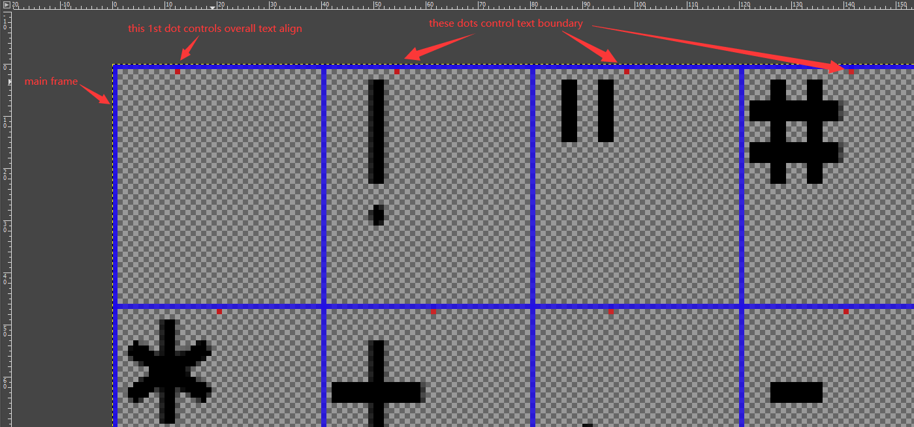
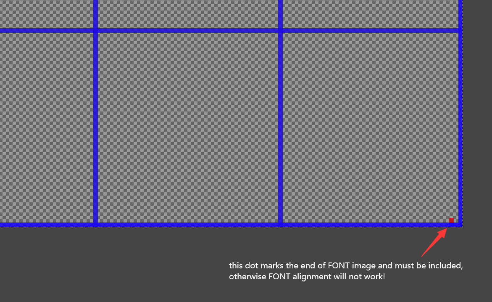

# Create and adjust image font for dashboard or HUD

RF2's image FONT supports BMP, TGA, and DDS format. Older mods usually use a special BMP format that contains transparent info. However it is not possible to retain this transparent info while editing and saving BMP in GIMP, so it is best to edit or create new FONT with TGA format (and TGA has far better transparency support).

Note: while saving TGA format through GIMP, make sure you have unchecked RLE compression checkbox, otherwise it may not work. Also need to edit cockpitinfo.ini and change each Font= section with correct .tga file extension.

FONT image consists many grids, usually draw with blue lines, each grid represent a single character. Unused character grids can be left empty so they won't show anything.

Characters boundary and text alignment are controlled by a single dot pixel at the top of the frame, usually purple color. The dot of the first grid controls how text will align, you may have to do some testing to find best position (dot at left side = left align, right side = right align, and in the middle you can tweak center align).
Also, there must be a single pixel dot at the bottom of last grid, otherwise text alignment will fail to work (and possibly other unwanted results), as below pics show:

FONT image does not require to have full character grids drawn on the image.

For example, a full grids set is usually 10x22 characters, which half of them are special characters. But if you don't need those special characters, you can remove those rows (such as 10x11 grids, by adjusting canvas size in GIMP), then make sure you add a single pixel dot at the bottom of last grid.

However, using half grids is highly not recommended for car dashboard! Because half grids FONT image will cause render artifacts on car's dashboard, which you will see a thin black edge line flashing at the edge of FONT. As far as I know, this issue can only be solved by using a full grids FONT image. In-game HUD can still use half grids FONT image without this problem.

In-game FONT image resolution is controlled by 2 factors: one is the FONT image size; one is the render target BKG image size (uses TGA format as well, and can be totally transparent). And this BKG image size is the more important factor. If the BKG image size is small, even with a high resolution FONT image, it will still be rendered as lower resolution in game.
