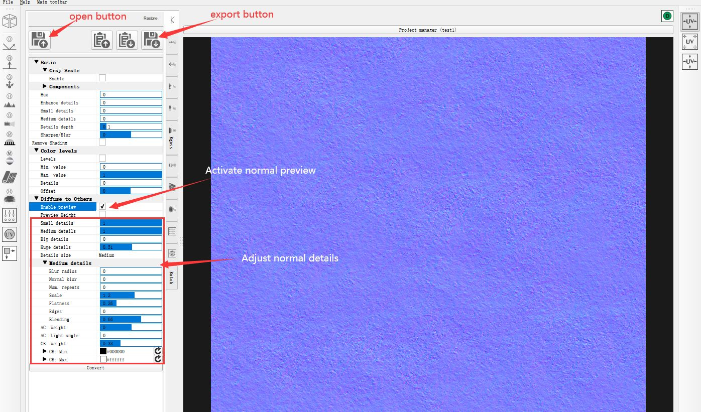

# Create PBR road material using Blender + GIMP

This guide provides some insight for creating new PBR road material for rF2 track mod.

The tools that I used for this guide are Blender & GIMP & Krita & AwesomeBump (all opensource programs), and using Dundrod track as an example.

# Create groove UV mapping in Blender

To create proper groove UV mapping, it requires to create a new UV mapping in any unused secondary UV channels of the road object, since groove requires and follows with player's best driving line which different from road's main UV mapping that follows along the center line.

I do this in blender by creating a groove line curve, then attaching a groove surface piece(with the new groove UV map) as Array to the groove line curve, then apply all modifiers and merge all groove surface pieces into one single piece and transfer the groove object UV mapping into each of the road objects' secondary UV channel. Below are some of the steps explain.

1
---
Create groove line curve, notice that groove line follows best driving line rather than main road center line.

2
---
Create a section of groove surface piece with groove texture UV mapping, then add array & curve modifiers that pointed to groove line curve. (you may further subdivide this piece for additional smoothness)

3
---
After subdividing, applying all modifiers and merging all groove pieces, notice how the groove is different from main road. And before continue, it is important to get the groove size correct for best visual.

Note: you also need to find & join together start & end of the groove mesh (remove any overlapping section), then apply "Follow Active Quads" from "UV" menu, this is to make sure that UV mapping is continuing through the entire groove mesh, otherwise it may cause visual problems in later steps with transferring UV mapping.

4
---
Next step is to snap this new groove mesh onto the main road surface(notice that I have also extended some groove section further to cover the side road sections). This can be done by switch to top down view(press Num7) in Edit mode, enable "Face" snap and "project individual elements". Then select all groove mesh, press "G" > press "Z" > press "Enter", and all mesh will be snapped to the ground surface(you may want to hide all none surface objects first).

Also note that, if you find snapping to be difficult to do (for example for track with big elevation changes or complex terrain), you can also manually move meshes vertically as close to the road surface as possible, and it will still work with UV transfer.

5
---
Now select road surface object, and MUST select "UVchannel_2" from right panel (make sure to do this for every road objects that will have groove mapping), this channel will be used for storing the new groove mapping.

6
---
With road surface object selected, Ctrl+Click on the groove object from right side layer panel to also select & highlight groove object (make sure groove object is the main selection). Then open "Transfer Mesh Data" from menu (or Ctrl+L), and MUST make sure "Data Type" is set to "UVs", and "Face Corner Mapping" set to "Nearest Face Interpolated". Repeat this step for all road objects.

Note: "Transfer Mesh Data" has many other usage and is a very powerful tool.

7
---
Now with all road objects mapped with groove in secondary UV channel, they can be exported to game for assigning new PBR material in material editor(make sure to set correct groove UV channel letter in material editor, in this case it should be "UV_B" which matches UVchannel_2 ). Here is how groove looks like with "Manual Groove" option on:

# Create groove & marbles texture in Krita & GIMP

For Dundrod track, I used Krita to create new groove texture from scratch. Krita offers powerful brush tools and a special "Wrap Around Mode" that is best for creating tiled textures.

1
---
Open Krita, and create a new 4096x2048 size image. From main menu > View, check "Wrap Around Mode", then select a good brush preset (there are a lot options to play with) to paint groove, and you can directly see how tiled texture looks like. You will need to paint several different variations (in different layers) with different amount skid marks and sizes and distributions, which will be used later for RED and GREEN channel of groove texture.

2
---
Export the painted image file as . PSD format, and open in GIMP. In my example, I have painted at least 4 different variations(2 for each RED and GREEN channel), which will be further adjusted and mixed together in GIMP.

3
---
Next step is to convert each groove variation into RED or GREEN color, which will be mixed together in final texture. There are many ways to do it, one of the common method is to use "Alpha to Selection" or "Channel to Selection", then create a new layer and fill either RED(#FF0000) or GREEN(#00FF00) color; or, using "Gradient Map" to directly transfer a layer to specific color(require to set gradient mode from "Gradient Tool" to "FG to BG", and both foreground and background color to be same), just an example.

4
---
After applied color to all skid mark layouts, it will look like following:

5
---
The next step is to fine tuning each color and testing the effects in game. This could be a long and time consuming work to get effect look good under different amount rubber. The final groove texture for used in Dundrod track looks like following, with a lot additional details, contrast, and mixing (Noise filter in GIMP is a very good tool for adding and tweaking details):

6
---
Marbles texture (Mdm) can be created in a similar way using GIMP's noise filter & cloud filter(mixing different amount noise, with blur filter and layer composition). Below is the Mdm texture created from scratch for Dundrod track:

# Create Road Overlay (ova) texture

Road overlay map is a tiled texture, which has to be carefully adjusted to have each edge side matched and minimizing repeated pattern or visual artifacts. Since GIMP doesn't offer native solution with tiled texture creation, it could be a little more work to create proper overlay map.

1
---
Open original road texture in GIMP, adjust canvas size to 4096x4096(or 2048x2048), add guide lines to each side of canvas boundary, then further extend canvas size(double size to 8192x8192) and center aligned.

2
---
Next, create a new layer and use "Clone Tool"(hold ctrl and click on target image will mark clone source, then you can paint cloned textures) to clone & extend the road surface outward to fill whole canvas and remove any unwanted texture. Note: make sure to check "Sample merged" box, so that clone source is not layer dependent.

3
---
Now tricky part is to adjust/clone the side edge of the center square road texture to make the edge seamless(could take a lot time by hand). Once done, use "Rectangle Select Tool" to select center square part of road texture, and from main menu > Image > Crop to Selection.

4
---
After cropping, you may further adjust brightness, color tint. And one last important step is to adjust layout opacity, which affects road material roughness(alpha channel).

It will looks like following with reduced saturation, less opacity(roughness), and can be exported as ***_ova.tga for MapConverter and assigned in material editor.

Note: for main road Albedo map texture, roughness is also controlled by opacity(alpha channel), as mentioned in official guide as well.

# Create Road AO Specular (aos) texture

Road AO Specular texture can be created directly using road overlay texture.
This texture map has noticeable effects to road fine details under different lighting condition, and surface wetness, etc.

1
---
Open road overlay texture. Set layer opacity to 100%(if not already set, or just remove alpha channel as it is not needed). Switch to Channel panel on the right, click once on "Red" & "Green" channel so that they become deselected. Set active foreground color to "Black"(#000000), and from main menu > Edit > Fill with FG Color.

2
---
Next, click on "Green, Blue, Alpha" channel "eye" icons to toggle visibility off & deselected, and make sure only "Red" channel is selected. Then from main menu > Colors, open "Levels" dialog, adjust contrast and brightness of Red channel (red channel is used for Specular strength).

3
---
Then do the same for Green channel(which is used for ambient occlusion). Hide "eye" icons and deselect "Red, Blue, Alpha" channel, and select & unhide Green channel. Open "Levels" and adjust contrast and brightness. Once all done, it will look like following with all channels visible, and ready to export as ***_aos.tga for MapConverter & assigned in material editor. It may take some tries to get best specular/AO effects.

# Create Road Normal (nm) texture

There are many programs can be used for generating normal texture, such as GIMP & AwesomeBump. AwesomeBump has much more adjustable options and is a more preferred tool, which I'll use as example.

1
---
You will first need a square road/asphalt texture. Usually "Road Overlay texture" is sufficient for this task, alternative you can also use a different & more detailed texture to generate normal texture.

2
---
Open AwesomeBump, on the left side, click "Open new image" button and select a base texture for processing. Next, click "Enable preview" checkbox (may need 1-2 clicks) until the whole image becomes blue on the right side, this enables normal preview. Then you can adjust normal with 4 different detail sizes(small, Medium, Big, Huge), each affects and adds different range of details. Click on "Detail size" drop list to select a detail size for fine tuning. Once done, click "Save current image" button to export texture as ***_nm.tga for MapConverter and assign in material editor.

Note 1: sometimes the generated normal map texture could be inverted (would look wrong in game with inverted normal). To fix this, set "Scale" value to the opposite value for all 4 detail sizes; or, use GIMP to invert color of exported ***_nm.tga texture.

Note 2: on the top right there is a "Project manager" button, which can be opened for saving or loading preset.

# Create Blend Wet Mask (bwm) texture

Blend Wet Mask add significant visual details to both dry & wet road condition. Red channel affects how Road Overlay texture blends with main road albedo texture; green channel affects details show in puddles.

1
---
BWM texture can be created using main road albedo texture as base(you can also add some other different road textures for more variation). The idea is to create a few detail texture(in black&white color for convenience) using the road albedo texture, and then use "channel to selection" (as mentioned in groove texture creation section) to extract required detail texture for "Red" & "Green" channel.

2
---
Here is how it looks like after extracting detail textures into "Red" & "Green" channel. (notice that I have created many different detail layers in layer panel for testing the best visual effect combo.)

3
---
And before exporting, you may want to fine tuning "Red" or "Green" channel (brightness, contrast, etc) separately using "Levels" or other color adjusting methods(merging all layers first), similar to the groove creation guide. For example, the following texture is used in Dundrod & Isle of Man(with various different tweaks):

Note: adjusting red channel brightness & contrast will shift blending between main Albedo & Overlay map. Adjusting green channel brightness & contrast will affect how much details seen from puddles.

Lastly, export the texture as ***_bwm.tga for MapConverter and assign in material editor.
