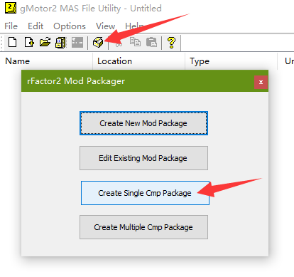
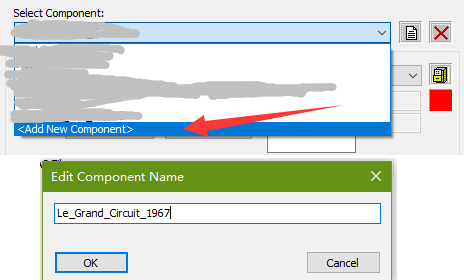
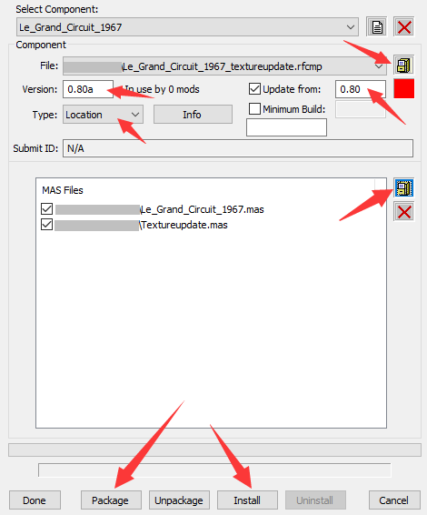

# Create track update package

To do a track update (such as replacing ad banners), most steps are the same as skinpack update for car. However there is one extra important step, which is also to include each layout mas file (just copy over from installed folder) and repack with the update mas into a new rfcmp (with new update version number), otherwise update wouldn't work.

`Le Grand Circuit 1967` mod is used as an example in this guide.

1
---
Open `rFactor 2\Support\Tools\MAS2.exe` .

2
---
Drag/drop all the new texture *.dds file (and assume all those new texture names match the original track's) into MAS2 window, press Ctrl+S to save as `Textureupdate.mas` (or any other name you like). You will also want to create a new folder somewhere to store `Textureupdate.mas` .

3
---
Go to `rFactor 2\Installed\Locations\Le_Grand_Circuit_1967\0.80` folder, copy `Le_Grand_Circuit_1967.mas` and place it in the same folder as `Textureupdate.mas` .

4
---
Click `Create the package file` button, then click `Create Single Cmp Package` .

5
---
Click drop down list and click `<Add New Component>` , then type `Le_Grand_Circuit_1967` (this name must match original track folder name)

6
---
Next you will have to properly configure remaining things as following:

1. Click `drawer` button beside `File:` drop down list to save `.rfcmp` (this will be the package file for installing).
2. In `Version:` box, type a new "update" version number (can't be same as original version).
3. Toggle on `Update from:` checkbox, and put exact original track version number.
4. In `Type:` box, select `Location` (this must be done). You may also want to click `Info` button to add extra info.
5. In `MAS Files` section, click `drawer` button and select `Le_Grand_Circuit_1967.mas` and `Textureupdate.mas`.
6. Click `Package` button at bottom, and wait packaging to finish. Then you can either click `Install` button to install now, or install from inside game.
7. Once all done, make sure to click `Done` button to save packaging setup.

Example setup:

