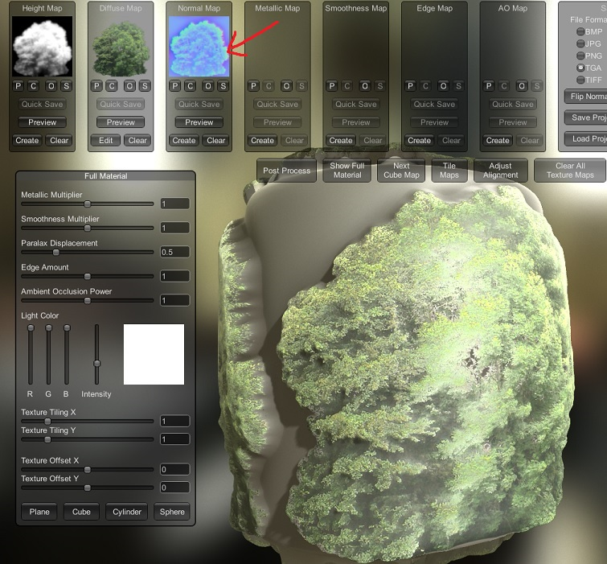

# Create translucent tree material

## The prerequisites

The object has to be self-rotating Billboard.

Enable `Billboard` option in IBL shader. And MUST set `Billboard` type to `Pointy`.

Enable `Translucency` option in IBL shader. Set `Power` value to `2` or `3` (usually 2).

## Create Normal Map:

Create a proper `Normal map` texture that has enough 3D depth, this is the most important thing to make the translucent effect work. If it doesn't have enough 3D depth info, the foliage object will usually look pitch black and flat when viewing against sunlight.

The difficulty here is to create proper normal map. There are mainly two types of tree normal map generation methods:
1. Almost all official tracks use 3D tree model assets which is then rendered into 2D with normal map (and other material maps) baked into 2D texture. This is the best approach and gives best 3D depth info. The only downside is that you will need to have those 3D tree models in order to generate them.
2. For most old tracks and tracks using real life tree photo assets, the above approach is not possible. But instead the Normal map texture has to be created using some "texture to normal map" programs. However, not all normal map programs can create enough 3D depth info.

For example, normal map generated using GIMP's built-in filter would have very small and flat 3D depth, which is not enough. Some of the other free normal map programs I have used are `AwesomeBump`, `Laigter`, `Materialize`. Among those, Materialize gives me best tree 3D depth, as it creates height map which adds real 3D depth for used in normal map generation. There are many parameters, which can take a lot trials to find suitable result.

How 3D depth looks in Materialize:

