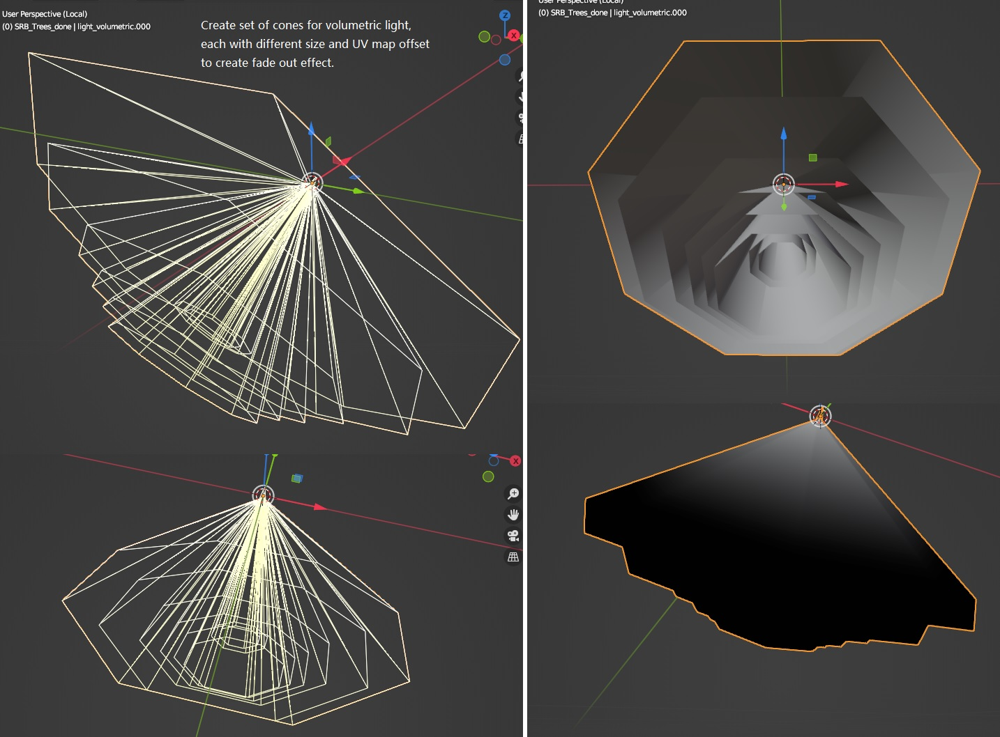
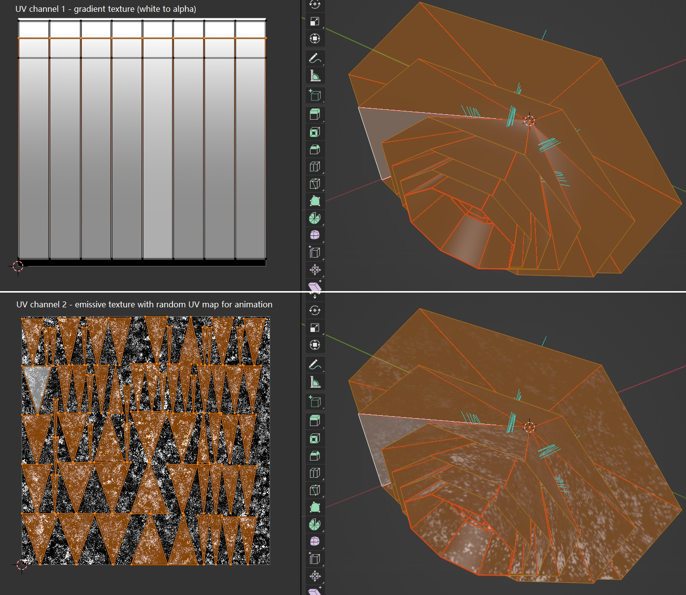
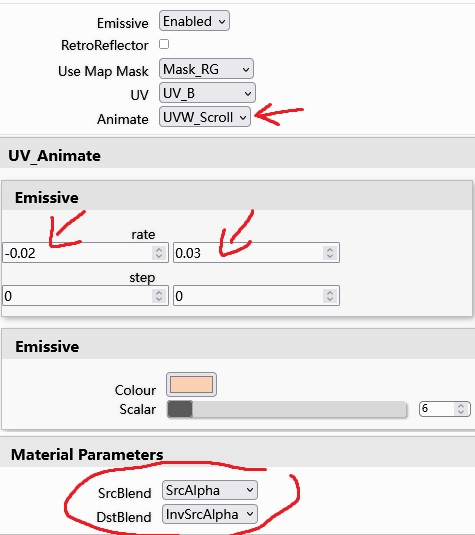

# Create volumetric lighting and animated dust effect

A method to simulate volumetric lighting in rF2 is to create a bunch of simple light cone shape meshes that mapped with a gradient texture (from white to alpha full transparency), overlapping them with slightly different size and UV map offset to create fade out effect.

Below is an example of volumetric lighting created for "Dundrod 1955" mod:

Light dust animation effect is done by create a special UV map (for emissive effect and animation) in secondary UV channel of the light cone object, with randomized UV mapping of each triangulated mesh faces, and create a noise texture map to simulate flowing dust.

Then in RF2's material editor, enable "Emissive" map and "Animated" option (which enables the new scrolling animation), set UV channel to second channel, and adjust scrolling rate (speed) based on UV axis. "Alpha blending" is required to have smooth transition with alpha transparency, since alpha chroma cannot have smooth alpha transition, and the tricky part is to create a gradient texture with right amount alpha transition to minimum quality loss (artifacts). I also used this scrolling emissive map technique for randomized road lights fluctuation animation. 

