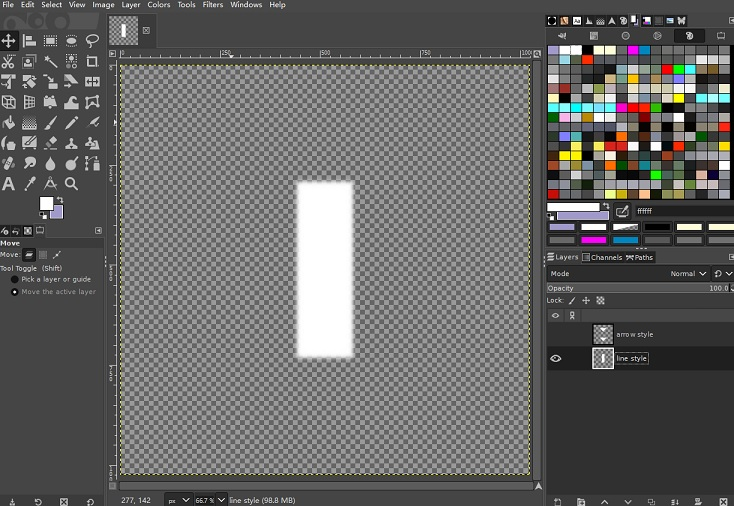

# Customize driving line texture

The idea is to create a new "DrivingLine_Alba.dds" texture file and packaged into track layout mas file. Since track layout mas file has higher assets loading priority, new driving-line texture will override built-in texture from game.

Steps:

1. Create a new texture, size 512x512 or 1024x1024 should be enough.

2. Create a new empty layer with alpha channel.

3. Draw a new shape that represent driving-line, and fill it with pure white.

4. (Optional)Apply slightly "Gaussian Blur" to the shape so the edges won't be too sharp.

5. Export image as TGA format and name it "DrivingLine_Alba", and use rF2 "MapConverter" tool (in "rFactor 2\Support\Tools\MapConverter" folder) to convert texture to "DDS" format.

6. Place new "DrivingLine_Alba.dds" inside the track's layout folder (as unpacked from mas file).

7. Use "MAS2" tool to either create a new track package, or a track update package. Then install and play in normal game.

Example texture:

