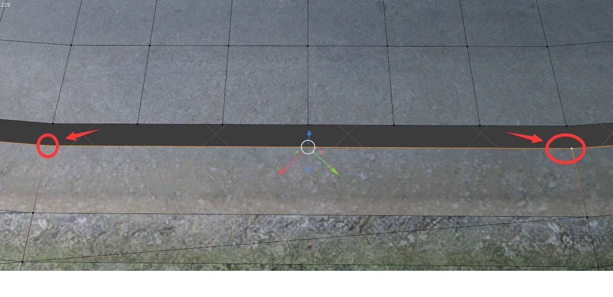
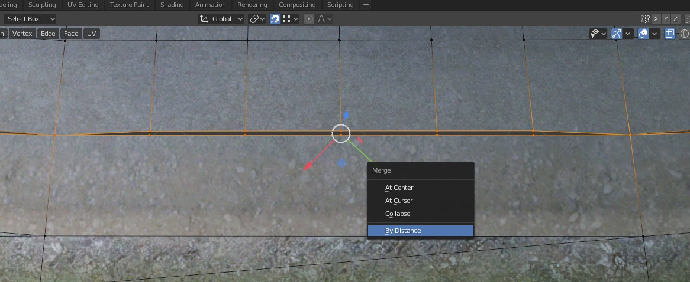

# Merge road and terrain surface gap using Blender

This guide shows methods to merge/snap "low poly" edge with "subdivided" road mesh edge using Blender.

## Method 1

Select 2 connected nodes from "low poly" edge.

Right click mouse and select Subdivide, then set amount cuts that match the road mesh edge.

Enable snapping (vertex), then select each node and move close to the road mesh node and will snap onto it. Repeat this until you fixed all gap (this is very time consuming unfortunately).

## Method 2 (easier way)

Select each node from "low poly" edge, and snap them to the nearby "subdivided" road mesh edge.

Select 2 connected node from "low poly" edge, and subdivide them (that match the amount road mesh), then select all those nodes and Press "m" > "By distance".

Adjust "Merge distance" value until all the nodes merged together.

## One side snap only

Sometimes we would like to snap road edge to nearby grass without affecting grass edge position (or the opposite way around).

The following method will save a lot time from manually snapping, and will make sure the targeted edge is not changed by merging. 

First, merge road and grass objects into one object. Alternatively, in case you don't want merge road and grass, you can extract a copy of grass edge, and merge this grass edge object with road object.

Then, select all the road edge vertices that you want to snap onto nearby grass edge, such as:

Press "M", select "By Distance", at lower left "Merge by Distance" box, check "Unselected" checkbox, then adjust "Merge Distance" until all edges snapped onto grass edge, done.

