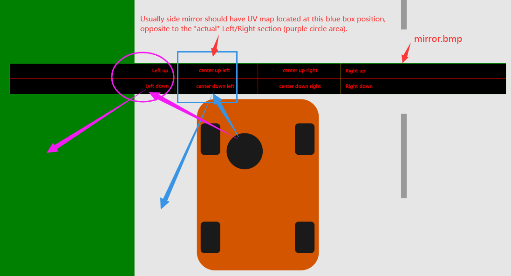

# Mirror UV map and mirror resolution

This guide shows proper methods for mapping car mirror UV and changing mirror resolution.

Note, mapping UV requires the use of 3D software, such as blender.

## Mirror UV map

First, need to determine view angle of the mirror. A good mirror.bmp with more grids will help determine the position better.

Usually side mirror should have UV map located at the edge of center area, opposite to what may seems to be the logical Left & Right position (which are actually viewing the far side areas). Below illustration should help with understanding:

## Mirror resolution

Mirror resolution is controlled by mirror.bmp resolution, default size is 2048*128. To increase resolution simply by double or triple this size, but do note that this aspect ratio should not be changed, in order to avoid distortion. Attempt to correct view angle by changing aspect ratio to 4:3 (800x600 or 1024x768) is not recommended (as seen in some mod), which causes distortion on some part of mirror or in virtual mirror. The correct way is to properly position the UV map.

Note: be aware that resolution and aspect ratio of virtual mirrors in DevMode is not affected by mirror.bmp, and should be tested in normal game to see if mirror is working correctly, to avoid wasting time.
