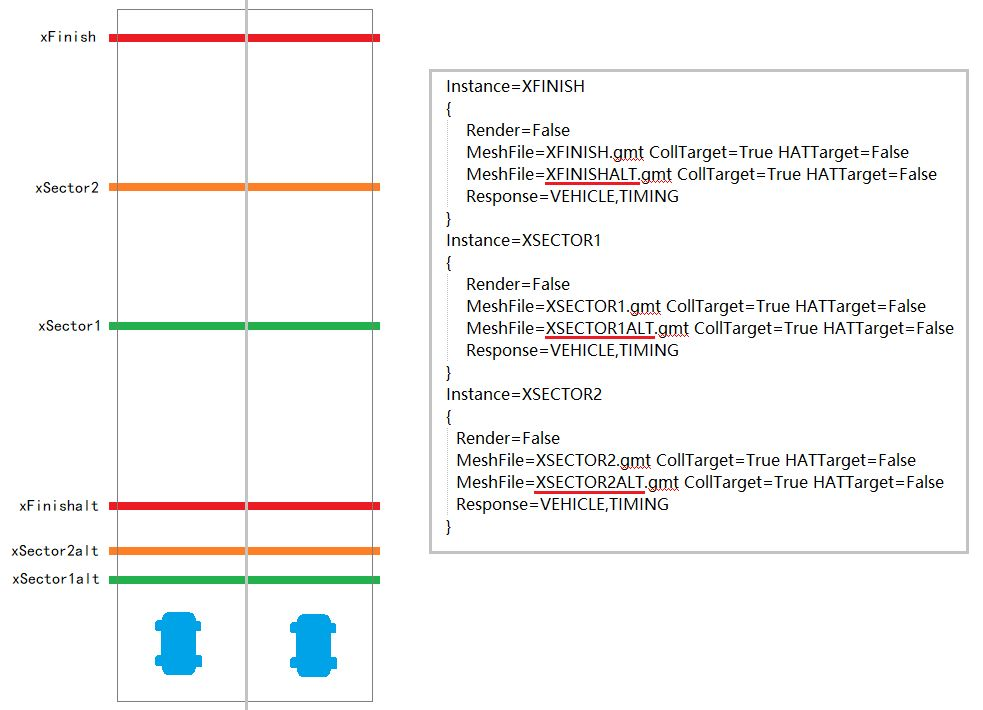
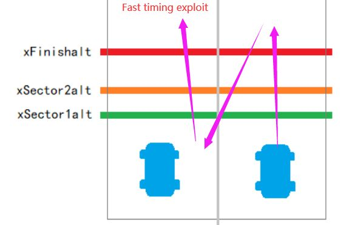
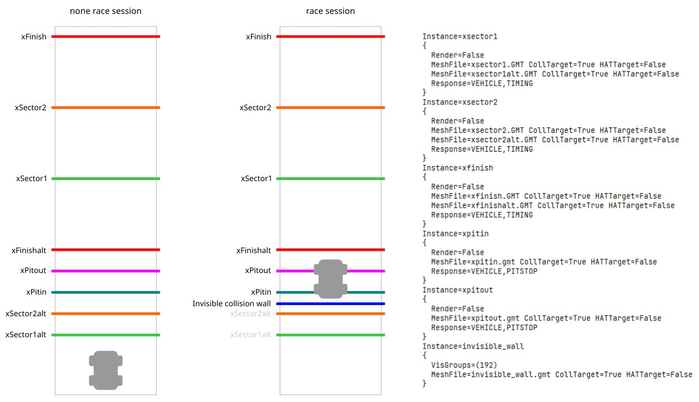

# Point to point timing sectors setup

Here are some notes related to the point to point timing sectors setup.

# Basic setup

There should be at least 1 meter gap between each alt sector/finish mesh. AIW could be tricky to set up.

For car starting location, a few possible solutions:

1. Have server admin order drivers to stop at the "blue car" position, and calls start from there. Downside is that it requires manual organization.

2. Same with first method, but also add some kind confined entry route or road ramp to limit player from having a further back starting location and gain advantage. Though unlikely it will be effective.

3. Place every garage spots at one of the blue car position, every cars will spawn & respawn at same spot. Then add walls around starting location so no car can drive further back and gain some advantage. For example, Targa florio rally stage uses this method.
(Current game will not enable collision for cars that overlap on each other initially when the car have not yet on track once, such as just joined server or at the beginning of a session. However, when this car has driven and returned to pit by ESC, there is a chance it will collide with other cars in garage. A simple solution is to just click DRIVE & ESC once or twice. It can be a bit annoying at times, but most of time works well and fast, and ensures fairness.)

All those are workaround, as game itself doesn't really support point to point, so there could be strange things happen at times.

# Alternative setup

There are some exploits related to the basic setup, where drivers could take advantages of those fast timing sector objects, resulting cheated lap time.

The exploit involves driving across xFinishalt to trigger a new lap timing, then driving backward past xSector1alt, and again driving forward through xSector1alt > xSector2alt > xFinishalt, which counts as a full lap and results cheated lap time.

## Workaround

First solution is to adjust cut corridor in between xFinishalt and xSector2alt in a special way, so that reverse driving would count as invalid lap. However, in practice this solution is very difficult to achieve and unreliable due to complex overlapping & parallel issues of corridors . And it also fails if flag rules is disabled.

Second solution is to move and keep both xSector1alt & xSector2alt far away from xFinishalt, so that there is enough distance to trigger wrong way warning & DQ. However this solution may not suit every track, especially if start grid or garage spot has to be placed just a few meters behind start line. (note, isle of man rally stages use this solution)

Third solution is to place xPitin and xPitout in between xFinishalt and xSector2alt.
Whenever player attempts to past xSector2alt > xFinishalt, both xPitin and xPitout will be inevitably triggered and lap time cancels immediately as a result of "pit-in timing cancel" mechanism. Unlike cut detection solution, this setup works under any non-race session, even if flag rules disabled, which makes it the best choice for rally stages that used in Targa florio.

## Additional issue & workaround

With the third solution, it is still possible to exploit fast timing sectors in race session, due to the fact that both xPitin and xPitout do not interact with player's vehicle during first lap, which effectively ignores "pit-in timing cancel" mechanism.

One workaround is to place an additional invisible wall that blocks the path to xSector1alt & xSector2alt in race session, which player has no way to interact with those fast timing sectors at all. This invisible wall must also be set with VisGroups=(192) so that it will only present in race session. And in addition, VisGroups does not work with Render=False tag, as collision detection fails to work if both tags were set, so the collision object needs a fully transparent material setup and without Render=False tag.

The final setup would look like following:

(there are a few track mods currently using similar workaround, such as DJCruicky's Nords and Targa florio.)

## Additional notes on "Exit pit under red" issue:

For point to point AIW that created from full length track path, such as Targa florio, where main driving path & pit lane path corridors & garage position would all messed up & overlap each other, which has high chance to trigger "Exit pit under red" warning even without leaving garage area. And since the overlapping section of main path cannot be simply removed because for some reason AI goes crazy otherwise, the workaround is by adjusting the garage spot position near the center of pit lane path cut corridor line until the "Exit pit under red" warning no longer triggers (takes a few tries to find the sweet spot, and vehicle size can also affect whether warning would be triggered, so it's better test with different vehicles).
