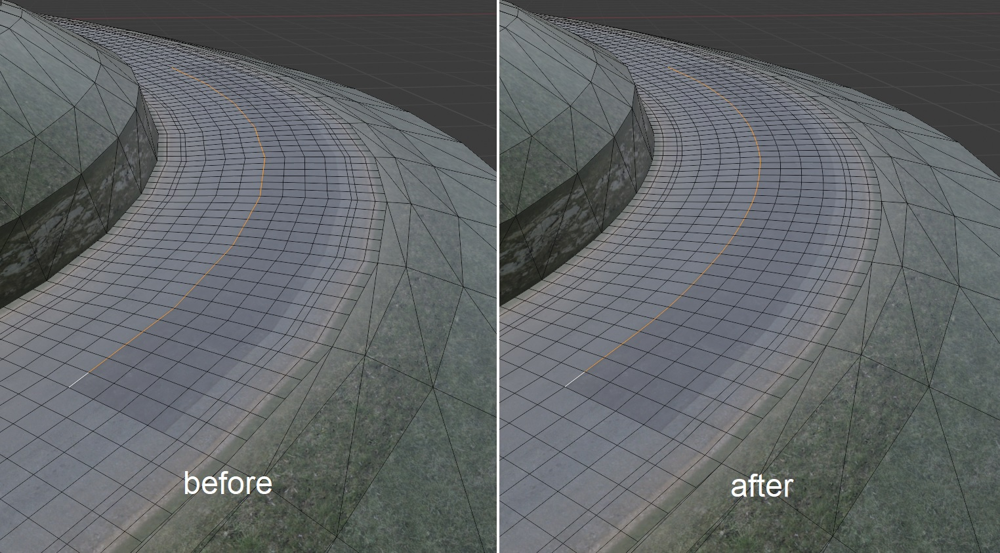
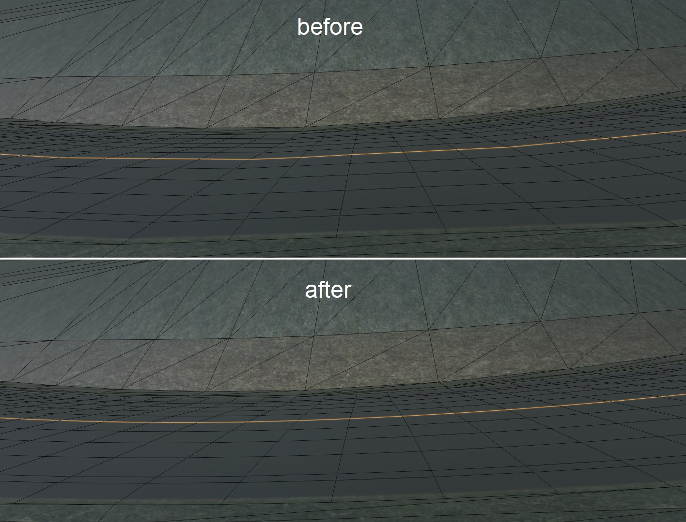

# Reconstruct road surface using Blender

This guide provides some insight for reconstructing road surface using Blender.

## Reconstruct surface

1. Select the object and press "Tab" to enter "Edit mode". (may want to merge separated objects together first)

2. Press "a" to select all vertices, press "m", select "By Distance", then adjust "Merge Distance" value carefully until all gaps are closed. (has to be done, otherwise face merging and loop cut may not work)

3. A few ways to merge triangle faces to quad face (has to be the same material):
    - Select all vertices, then from menu select "Face" > "Tris to Quads", or by pressing "Alt+J" to convert all faces to quad.

    - Manually select 2 connected triangle faces and press "F" to merge them into a quad face.

    - In case of some remained vertices, manually select 2 connected triangle faces and press "X", then select "Dissolve Faces" and check "Dissolve Verts" box. Or, merge face first, then select those unwanted vertices and press "X" > "Dissolve Vertices".

    - "Slide Vertices" (Shift+V) is also great way to fix some complex issue with face merging.

4. Use "Loop Cut" (Shift+R) to subdivide the face.

## Smoothing surface

Sometimes it is necessary to smooth the track surface to eliminate rough poly-like edges for better driving feel. This can be done using Blender's LoopTools addon to smooth road:

1. Main menu > EDIT > Preferences > Add-ons, search keyword "loop" and find Mesh: LoopTools, enable it.
2. Enter Edit Mode view, active edge select (press 2).
3. Select the continued edges you want to smooth (you can hold Alt to do loop select).
4. Click right mouse, on top select LoopTools > Relax.
5. At lower left screen, click Relax message box to expand, and adjust 4 smooth options.

Additional notes:

1. Regular checkbox will evenly distribute vertices, which may distort UV map, recommended to uncheck it (unless you plan to remap UV later).
2. Linear Interpolation gives much rounded results, but may destroy some corner bending.
3. Parallel (all) input can also smooth paralleled edges without select them, works great for symmetric road, but be aware that it may break some road with uneven edges.
4. Sometimes smoothing a long section may cause model broken, usually undo and repeat "Relax" should fix it.

This also helps to smooth the elevation:

